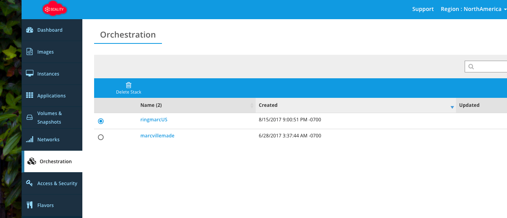

Via the web interface under the orchestration tab:

|ID                                       | Name           | Status | Networks                       | Image Name                                                 |
|------------------------------------------|----------------|--------|--------------------------------|------------------------------------------------------------
| 4d0d392d-55ea-44b3-86e4-a89507daecb8**   | c7-store-2     | ACTIVE | tenantnetwork1=10.200.125.188  | CentOS-7-x86_64-GenericCloud-1612 (CentOS7.3)              |
| 94aa377c-a3ef-40ca-8f2f-735de7ae6ef2**   | c7-store-3     | ACTIVE | tenantnetwork1=10.200.125.187  | CentOS-7-x86_64-GenericCloud-1612 (CentOS7.3)              | 
| 8d936ace-4c8d-432f-887d-e93b94241232**   | c7-store-0     | ACTIVE | tenantnetwork1=10.200.125.184  | CentOS-7-x86_64-GenericCloud-1612 (CentOS7.3)              |
| 1efb178f-819e-4925-975c-05556cabf46b**   | c7-store-1     | ACTIVE | tenantnetwork1=10.200.125.185  | CentOS-7-x86_64-GenericCloud-1612 (CentOS7.3)              |
| 0bb6ac29-1776-4ce7-9321-5b7314d6744c**   | c7-store-5     | ACTIVE | tenantnetwork1=10.200.125.182  | CentOS-7-x86_64-GenericCloud-1612 (CentOS7.3)              |
| **bbbd833b-b02d-4eff-9187-812c08457804** | **c7-conn-2**  | ERROR  |                                | CentOS-7-x86_64-GenericCloud-1612 (CentOS7.3)              |
| a5128080-4a19-477c-b155-ab5c3bc7b59b**   | c7-store-4     | ACTIVE | tenantnetwork1=10.200.125.179  | CentOS-7-x86_64-GenericCloud-1612 (CentOS7.3)              |
| **60ad88ee-eed1-4346-a050-4bd275b460f4** | **c7-conn-0**  | ERROR  |                                | CentOS-7-x86_64-GenericCloud-1612 (CentOS7.3)              |
| f0925f66-720a-48ec-a298-64ba066f3d81**   | c7-conn-1      | ACTIVE | tenantnetwork1=10.200.125.178  | CentOS-7-x86_64-GenericCloud-1612 (CentOS7.3)              |
| 60eaa48d-2ca6-4c8b-9c0f-7d0ed7bb053f**   | c7-super       | ACTIVE | tenantnetwork1=10.200.125.176,217.182.11.73 | CentOS-7-x86_64-GenericCloud-1612 (CentOS7.3) |

